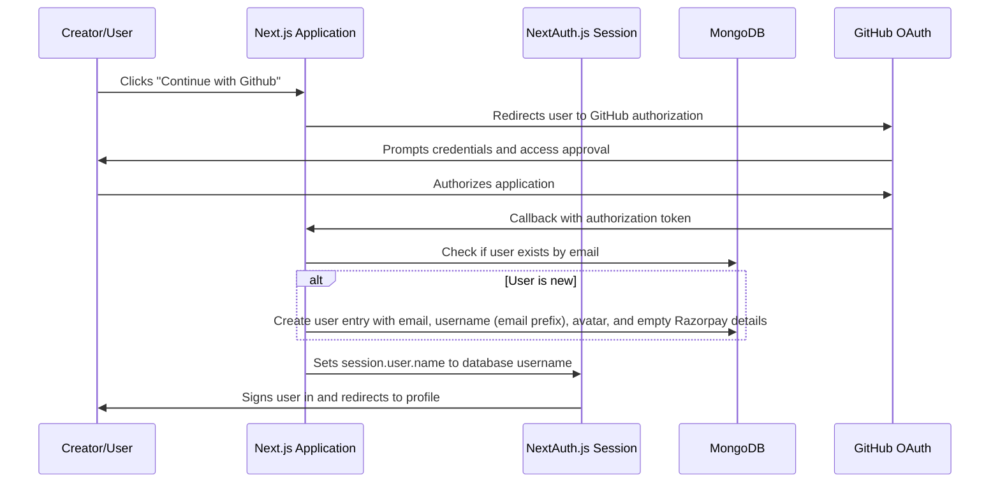
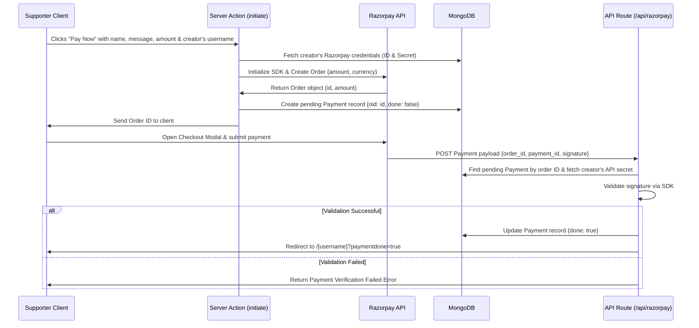

# Get Me A Chai

Get Me A Chai is a modern crowdfunding and patronage platform built with Next.js, and MongoDB. It allows content creators to receive direct support ("chai") from their followers. The platform implements a decentralized payment flow where creators can register their own Razorpay API credentials, ensuring contributions are sent directly to their personal Razorpay accounts.


## Project Overview

Get Me A Chai helps creators monetize their content by letting fans buy them a "chai". The platform utilizes GitHub OAuth for creator sign-ins, maintains a public creator directory page (`/network`), and processes transactions using Razorpay. By integrating creators' personal Razorpay IDs and secrets, payments go straight to the destination account without platform-wide routing delays.


## Features

* **GitHub OAuth Authentication:** Secure authentication using NextAuth.js (GitHub Provider).
* **Decentralized Razorpay Integration:** Creators can input their personal Razorpay API credentials in their profile, enabling direct peer-to-peer payments.
* **Public Creator Pages (`/[username]`):** Publicly accessible pages showcasing creator avatars, custom banner covers, and payment forms.
* **Support Messages:** Supporters can leave customized names and support messages when donating.
* **Top Contributors Leaderboard:** Displays up to 10 completed payments per creator, sorted by contribution amount descending.
* **Creator Directory (`/network`):** A directory showing cards of all registered creators, complete with banners, names, and links to visit their pages.
* **Profile Management:** Creators can customize their display name, profile picture URL, cover banner URL, and Razorpay credentials.


## Tech Stack

* **Frontend Framework:** Next.js (App Router, version 16.2.6)
* **Library:** React (version 19.2.4)
* **Styling:** Tailwind CSS (version 4) with PostCSS
* **Database:** MongoDB + Mongoose (version 9.7.1)
* **Authentication:** NextAuth.js (version 4.24.14)
* **Payment Processing:** Razorpay Node SDK (version 2.9.6) & Razorpay Client Checkout

---

## Folder Structure

```text
get_me_a_chai/
├── app/
│   ├── [username]/
│   │   └── page.js               # Public profile and payment page
│   ├── actions/
│   │   └── useraction.js         # Next.js Server Actions (initiate, fetchuser, updateProfile)
│   ├── api/
│   │   ├── auth/
│   │   │   └── [...nextauth]/
│   │   │       └── route.js      # NextAuth.js configuration (GitHub provider & callbacks)
│   │   └── razorpay/
│   │       └── route.js          # Razorpay signature validation and payment webhook
│   ├── components/
│   │   ├── Footer.js             # Shared footer component
│   │   ├── Main.js               # Landing page content component
│   │   ├── Navbar.js             # Shared header navigation bar
│   │   ├── SessionWrapper.js     # NextAuth SessionProvider wrapper
│   │   └── Userpage.js           # Client-side payment form & contribution records
│   ├── db/
│   │   └── connectDb.js          # Mongoose connection utility
│   ├── help/
│   │   └── page.js               # Help static page placeholder
│   ├── login/
│   │   └── page.js               # OAuth selection screen
│   ├── models/
│   │   ├── payment.js            # Payment mongoose schema definition
│   │   └── user.js               # User/Creator mongoose schema definition
│   ├── network/
│   │   └── page.js               # Public directory listing all creators
│   ├── globals.css               # CSS file containing tailwind directives
│   ├── layout.js                 # Root layout configuration with background gradient
│   └── page.js                   # Landing entry point (renders Main)
├── public/                       # Static assets (images, gifs, icons)
├── jsconfig.json                 # Path aliases config
├── next.config.mjs               # Next.js configuration
├── package.json                  # Dependencies and build scripts
└── postcss.config.mjs            # PostCSS configuration
```

---

## Installation Guide

### Prerequisites
* **Node.js:** Ensure Node.js is installed.
* **MongoDB:** Local MongoDB instance or a MongoDB Atlas URI.
* **GitHub Account:** A registered developer application on GitHub to retrieve Client credentials.
* **Razorpay Account:** A Razorpay account to retrieve sandbox/production credentials.

### Step-by-Step Setup

1. **Clone the Repository:**
   ```bash
   git clone <repository-url>
   cd get_me_a_chai
   ```

2. **Install Dependencies:**
   ```bash
   npm install
   ```

3. **Configure Environment Variables:**
   Create a `.env.local` file in the root directory and add the required environment variables (see [Environment Variables](#environment-variables)).

4. **Run the Development Server:**
   ```bash
   npm run dev
   ```

5. **Access the Application:**
   Open [http://localhost:3000](http://localhost:3000) in your web browser.


## Authentication Flow



1. **Sign-In Initiated:** A user navigates to `/login` and clicks the GitHub option.
2. **GitHub Validation:** NextAuth directs the user to sign in to GitHub and authorize the application.
3. **Database Check & User Creation:** The `signIn` callback in `route.js` connects to MongoDB and searches for a user matching the GitHub account email:
   * If a user is not found, a new User document is created with a `username` derived from their email prefix, a `profilepic` using their GitHub avatar image, and empty values for `razorpayid` and `razorpaysecret`.
4. **Session Mapping:** The `session` callback query fetches the creator’s database entry and overrides `session.user.name` with their customized database `username`.

---

## Payment Flow



1. **Initiation:** The supporter enters their name, message, and amount on `/[username]` and clicks "Pay Now".
2. **Order Creation (Server):** The `initiate` Server Action fetches the recipient's `razorpayid` and `razorpaysecret` from the database. It instantiates a Razorpay transaction using their unique credentials and registers the order.
3. **Database Logging (Pending):** A pending document is logged in the `Payment` collection containing the Razorpay Order ID (`oid`), recipient's `username` (`to_user`), sender details, and amount.
4. **Client Checkout:** The client receives the Order ID, loading the Razorpay popup using the platform's public key (`NEXT_PUBLIC_KEY_ID`).
5. **Callback Verification:** Upon completing the transaction, Razorpay posts data to the `/api/razorpay` route handler. The callback:
   * Finds the pending order record in MongoDB.
   * Pulls the recipient creator's secret to perform signature verification.
   * Updates the `Payment` document flag to `done: "true"` and redirects the client back with a `paymentdone=true` query.

---


## User Journey / Application Flow

1. **Browse Home:** Visit the landing page to read about the project.
2. **Authenticate:** Go to `/login` and sign in with GitHub.
3. **Setup Profile:** Navigate to `/profile` (if authenticated) to update settings:
   * Set custom display name, profile avatar, and banner URLs.
   * Provide personal `Razorpay ID` and `Razorpay Secret` keys.
4. **Discover Creators:** Access `/network` to view all registered creators and check out their pages.
5. **Support Creators:** Navigate to `/[username]`, enter details, and complete a payment.
6. **Confirmation:** The supporter is redirected to `/[username]?paymentdone=true`, and their message displays on the creator's page list.

---

## API Routes

### 1. OAuth Callback Route
* **Endpoint:** `GET /api/auth/[...nextauth]` & `POST /api/auth/[...nextauth]`
* **Description:** Manages the OAuth lifecycle for NextAuth integration. Only the GitHub provider is functionally integrated.

### 2. Razorpay Verification Webhook Callback
* **Endpoint:** `POST /api/razorpay`
* **Description:** Verifies payment transaction status:
  * Reads Order ID, Payment ID, and Signature.
  * Validates transaction integrity using the destination creator's secret credentials.
  * Updates payment status to success (`done: "true"`) and handles redirection.

---
